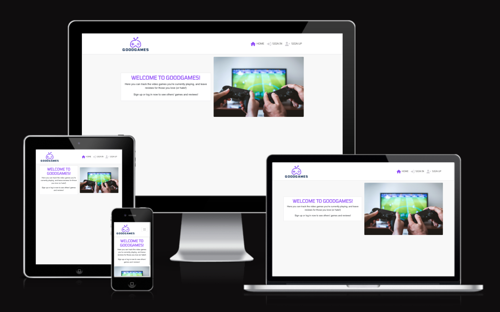
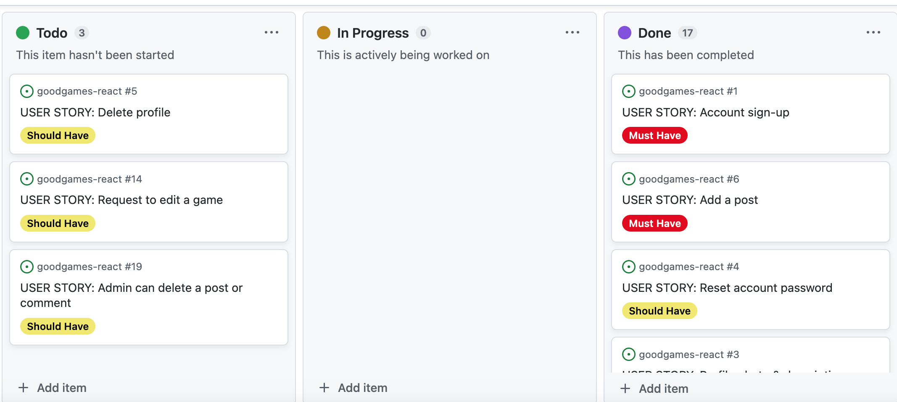

# GoodGames

Welcome to the React Frontend for GoodGames!

GoodGames is a website where you can share the video games you're currently playing, and leave a review for each game. You can leave comments on other users' posts. You can like other users' posts, comments, reviews, and games, and customise your own profile image and description.

This is the frontend of the appliation, built with React.

- The deployed version of the full site built in React is [HERE](https://goodgames-react.herokuapp.com/).
- The deployed version of the API is [HERE](https://goodgames-drf-api.herokuapp.com/).
- The backend repository is [HERE](https://github.com/StephHjar/goodgames-drf-api).

## Wireframes

In the planning stage of this project, I created basic wireframes for desktop and mobile versions of the main pages of the site (posts and games, which would have the same layout):

## User Stories

I have divided the functionality of the site and database into epics and user stories below. These are also documented on my GitHub Project board found [here](https://github.com/users/StephHjar/projects/6/views/1).

This is the view at the end of my project:

All user stories marked 'Must Have' have been completed, and some 'Should Have' user stories are still to be completed. The site functions without these, but they should be implemented in future sprints to create a better user experience.

### **Epic:** Account Management

**User Stories:**

- As a **user** I can **sign up for an account** so that I can **make and like posts, and add games**
- As a **user** I can **log in and out of my account** so that I can **access the site from different devices and keep my account secure**
- As a **user** I can **add a profile photo and description** so that **I can personalise my profile**
- As a **user** I can **request to reset my password via email** so that **I can log back in to my account if I forget my login details**
- As a **user** I can **delete my profile** so that **my personal details are not saved if I don't want to use the site anymore**

### **Epic:** Managing Posts

**User Stories:**

- As a **user** I can **add a new post** so that **I can show when I start playing a game**
- As a **user** I can **edit my posts** so that **I can make updates, or mark when I have finished playing the game**
- As a **user** I can **delete my posts** so that **I can remove posts made in error, or that I don't want displayed on my profile anymore**
- As a **user** I can **like and unlike other users' posts** so that **I can engage with content that I enjoy**

### **Epic:** Managing Comments

**User Stories:**

- As a **user** I can **comment on other users' posts** so that **I can engage in conversations with other users**
- As a **user** I can **edit comments I have made** so that **I can correct mistakes in my comments**
- As a **user** I can **delete comments I have made** so that **I can remove comments posted by mistake**

### **Epic:** Managing Games

**User Stories:**

- As a **user** I can **request to add a new game to the site's database** so that **I can leave reviews and share the game on my profile**
- As a **user** I can **request edits to an existing game** so that **the information on the site is correct**
- As a **user** I can **add a review to a game** so that **I can share my thoughts on the game with other users**
- As a **user** I can **edit or delete my own reviews** so that **I can fix errors or change my review if my opinions change**
- As a **user** I can **like other users' reviews** so that **I can engage with other reviews I agree with**

### **Epic:** Admin Capabilities

**User Stories:**

- As a **site admin** I can **add, edit, and delete games from the database** so that **users have the most up-to-date list of games to choose from**
- As a **site admin** I can **remove posts or comments if they are not appropriate or relevant** so that **the site is enjoyable and accessible to all users**
- As a **site admin** I can **see lists of all user profiles, posts, games, reviews, likes, and comments** so that **I have an overview of all activity on the site**

## Testing

Please see my [testing file](TESTING.md) for all manual and validator testing.

## Deployment

In package.json file, in the “scripts” section, add the following prebuild command:

"heroku-prebuild": "npm install -g serve",
This will install a package needed to serve our single page application on heroku

Add a Procfile at the root of the project with the following web command:

web: serve -s build

## Credits

### Content

- In order to get all game titles from my DRF API database to populate in the "Add Post" form, I used the following resources:
  - [This YouTube video](https://www.youtube.com/watch?v=x48RYuXKs7c) from Haritha Computers and Technology (thank you to my mentor, Martina, for sharing this with me!)
  - [This page](https://dev.to/haalto/recursively-fetch-data-from-paginated-api-34ig) on Dev.to about pulling data from a paginated API.
  - [This page](https://dev.to/hariseldon27/localecompare-and-sorting-in-javascript-1god) again on Dev.to to learn how to sort the game titles alphabetically.
  - I also borrowed code / syntax from GameDataContext provider.
- I used [this thread](https://stackoverflow.com/questions/46820682/how-do-i-reload-a-page-with-react-router) and [this thread](https://stackoverflow.com/questions/65707107/react-routing-to-specific-page-not-working) on StackOverflow to have the handleDelete functions for Post and Game refresh the existing page if they are on the List page, rather than redirect the user back to the previous page. If they are on any page other than the List page, deleting a Post or Game will redirect them back to the List.
- Deployment steps are adapted from Code Institute's Momments walkthrough.

### Media

- I used [Canva](https://www.canva.com/) to create the GoodGames Logo.
- I used [CloudConvert] to convert images to WEBP format.
- I used [Favicon Generator](https://favicon.io/) to create my favicon.
- The sign up form photo is by by [Javier Martinez](https://unsplash.com/@cjdante?utm_source=unsplash&utm_medium=referral&utm_content=creditCopyText) on [Unsplash](https://unsplash.com/photos/hUD0PUczwJQ?utm_source=unsplash&utm_medium=referral&utm_content=creditCopyText).
- I used [Color Picker](https://imagecolorpicker.com/en) to generated hex codes for colours from images.
- The 'no results' icon is from [Flaticon](https://www.flaticon.com/free-icon/not-found_1178479).
- The image on the main page is by [JESHOOTS.COM<](https://unsplash.com/@jeshoots?utm_source=unsplash&utm_medium=referral&utm_content=creditCopyText) on [Unsplash](https://unsplash.com/photos/eCktzGjC-iU?utm_source=unsplash&utm_medium=referral&utm_content=creditCopyText).

Thank you to my mentor, Martina, for the helpful tips and guidance.
And special thank you to my fiancé Jonathan for supporting me through this course, being by my side through all the wobbles, and generally being the pest parter I could have asked for as I dedicated so much time to this project. ❤️
