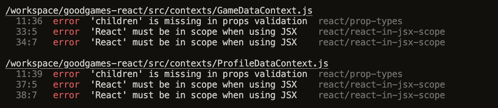
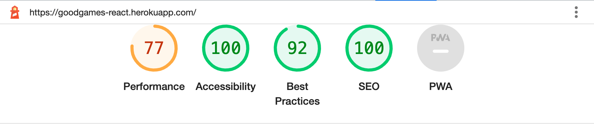
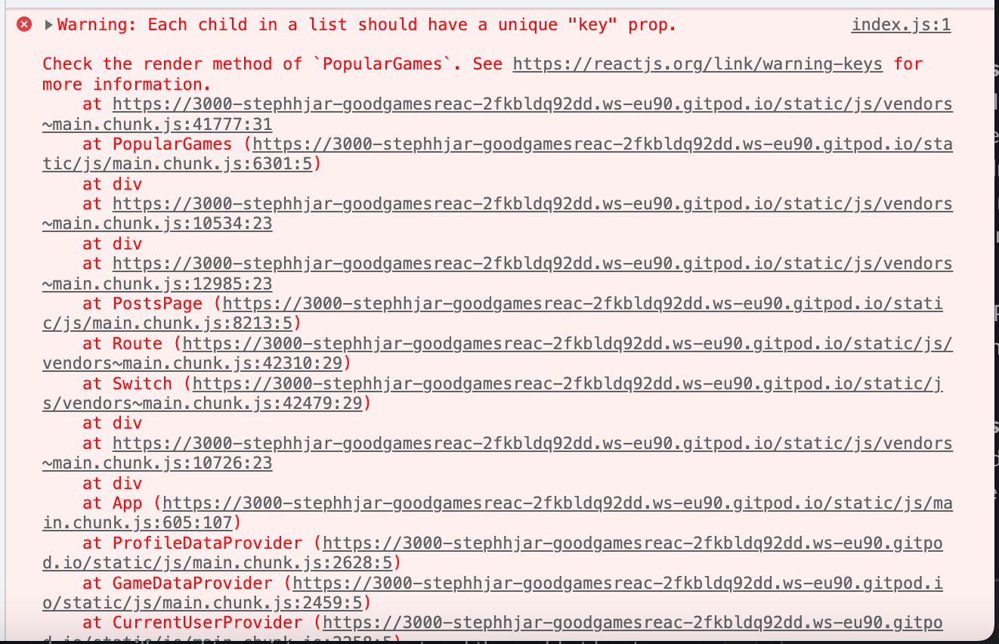
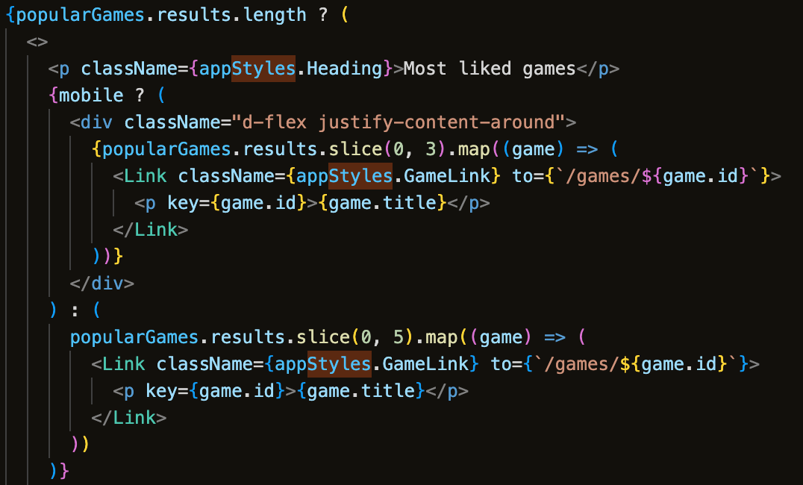

### Manual Testing

- Tested CRUD functionality for all resources:
  - Comments
  - Games
  - Posts
  - Profiles
  - Reviews
  - Likes
- All nav links are functional. Links either open in a new window (if there is no navigation on the target page), or new pages provide the option to go back.
- Users must be logged in to add Posts & Games, and edit their own Commens, Posts, Profiles, and Reviews.
- Only an admin / superuser has access to editing and deleting games.

The site was tested for responsiveness on the following desktop and mobile devices: Macbook (Chrome and Safari), iPhone13 (Chrome and Safari).

### Validator Testing

- HTML
  - When passing through the [W3C validator](https://validator.w3.org/) I received no errors and 11 notes, all related to trailing slashes. These have been left in place as the Prettier code formatter automatically inserts these.
    - [Link to PDF report](src/assets/readme/HTMLValidator.pdf)
- CSS
  - When passing through the [Jigsaw validator][https://jigsaw.w3.org/css-validator/] I received an error in both CommentCreateEditForm.module.css & ReviewCreateEditForm as one colour attribute was missing a `#`.
    - [Link to PDF report](src/assets/readme/CSSValidator.pdf)
  - I also received an error saying that the `scale` attribute does not exist, for resizing the checkboxes in PostCreateEditForm. Adjusting this to `transform: scale(0.5);` resolved the error with the same end result on the deployed site.
    - [Link to PDF report](src/assets/readme/CSSValidator2.pdf)
- JavaScript / React
  - When passing through ESHint in Gitpod, I received a number of errors around props not being validated, across all files with props (an example screenshot is below). I also received errors in my context files since React had not been imported. I resolved the React errors by importing React into these files. Based on some research, including [this article](https://forhjy.medium.com/react-solution-for-children-is-missing-in-props-validation-eslint-react-prop-types-2e11bc6043c7) I have decided to leave these errors unresolved for now, as the project is limited in scope and these do not affect its functionality.
    

### Lighthouse Testing

The site scores highly for accessibility in Lighthouse testing. Suggestions for improving performance were:

- Reducing unused JavaScript (files included in the node_modules, which were provided by Code Institute).
- Setting images to specific sizes (which I have not done to ensure the site is responsive).
- Minifying JavaScript (outside the scope of this project).
- Eliminating render-blocking resources (which were imports for Bootstrap, FontAwesome, and Google Fonts).

### Fixed Bugs

See the [closed issues tab](https://github.com/StephHjar/goodgames-react/issues?q=is%3Aissue+label%3Abug+is%3Aclosed) labelled 'bug' in my GitHub repository for bugs that arose and how I resolved them.

### Unfixed Bugs

There is one unresolved terminal error, related to the PopularGames component:

The reason the children don't have unique key props is because I am actually rendering two lists: one that is visible in the desktop view of the application, and the other which is visible in the mobile view:

I have assigned the `game.id` as the key value in each list, which means it is technically assigned twice: once in the mobile view, and once in the desktop view. Because both views never appear together at the same time on the page, and this does not affect the functionality of the component or the application, I've elected to leave this bug unresolved.
